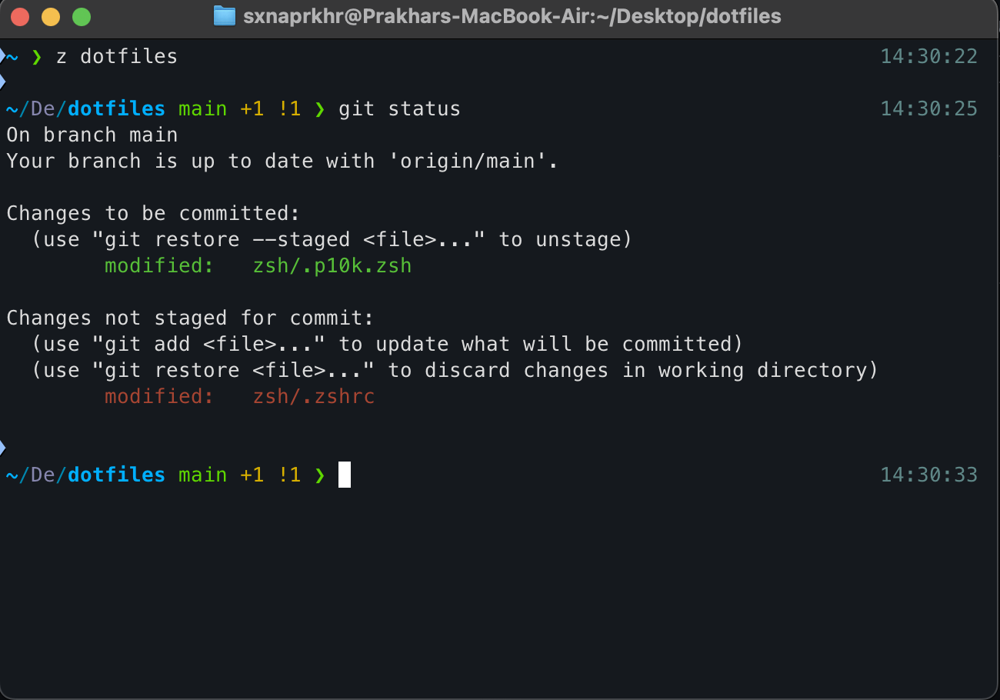

# dotfiles

**[MacOS]** This repository contains my dotfiles.

## Installation

### Steps for git

1. Add [.gitconfig](https://github.com/sxnaprkhr/dotfiles/blob/main/git/.gitconfig) to `~`

### Steps for iTerm2

1. Download [iTerm 2](https://iterm2.com/)
2. Add [com.googlecode.iterm2.plist](https://github.com/sxnaprkhr/dotfiles/blob/main/iterm2/com.googlecode.iterm2.plist) to `~/Library/Preferences`

### Steps for zsh

0. Requires zsh to be default.
1. Download [oh my zsh](https://ohmyz.sh/)
2. Download [p10k](https://github.com/romkatv/powerlevel10k) using oh my zsh step
3. Download [z.sh](https://github.com/rupa/z)
4. Download [zsh-autosuggestions](https://github.com/zsh-users/zsh-autosuggestions/)
5. Replace `~/.zshrc` with [.zshrc](https://github.com/sxnaprkhr/dotfiles/blob/main/zsh/.zshrc)
6. Replace `~/.p10k.zsh` with [.p10k.zsh](https://github.com/sxnaprkhr/dotfiles/blob/main/zsh/.p10k.zsh)
7. Run `touch .hushlogin` && `source ~/.zshrc`